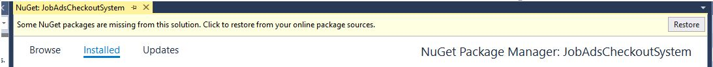
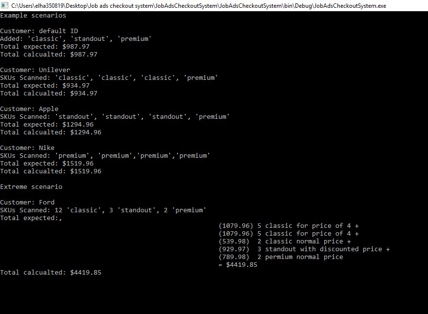
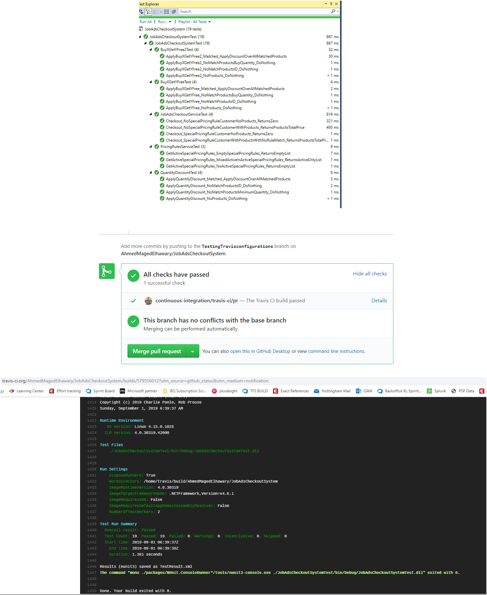

##### This is a C# console application developed using Microsoft Visual Studio 2017, .Net Framework 4.6.1.
##### To download the framework please click: **https://go.microsoft.com/fwlink/?linkid=2099470**

#### The solution contains two projects
JobAdsCheckoutSystem  
JobAdsCheckoutSystemTest  

##### For successful build you will need to restore Nuget for each, Visual studio should show a pop up suggesting Nuget restore

##### To ensure NuGet is restored, you can select each project then navigate to Project - Manage Nuget Packages.

##### The main exe should be under JobAdsCheckoutSystem project folder under **bin\Debug\JobAdsCheckoutSystem.exe**.

##### It shows a demo of the software that can be traced under Program.cs.

##### JobAdsCheckoutService offer a public function that accept CustomerID and list of products
#### The function algorithm follows three simple steps:
1- Retrieve the relevant pricing rules of this customer. 
2- Apply these list of rules over the products list. 
3- Return the total price. 

##### Data of rules/products are stored under Json files
##### Repository pattern was followed to isolate the data access layer from the business logic layer
##### Two implantations of first discount rule were provide for BuyXGetYFree rule and only one for QuantityDiscount rule.

##### The system was designed to also justify the final price and map the applied rule and to handle real live complex scenarios. 

##### A copy was uploaded over GitHub repository: **https://github.com/AhmedMagedElhawary/JobAdsCheckoutSystem**
##### Continuous integration was enabled via Travis-CI to check against Unit testing/Building errors.

